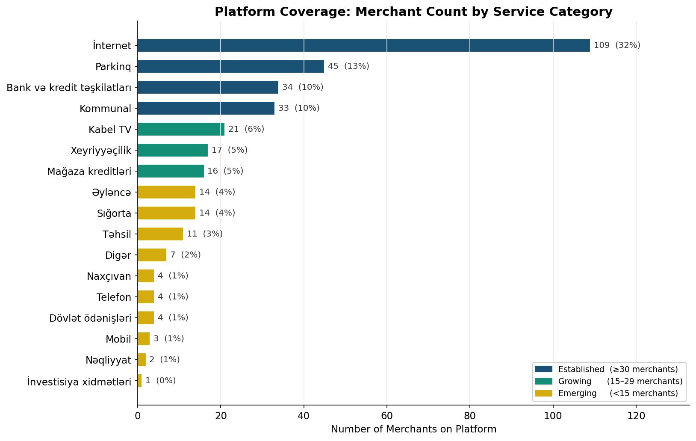
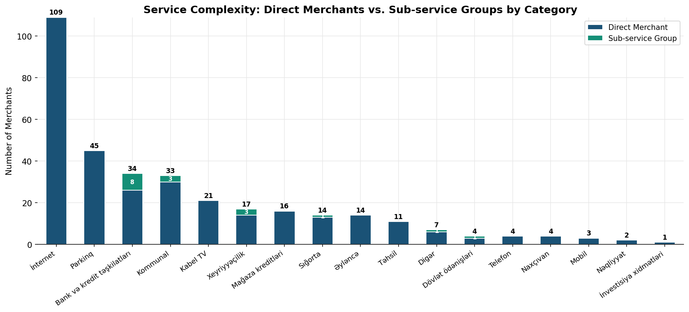
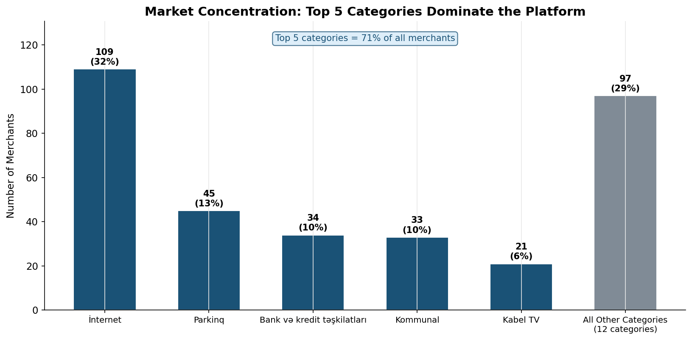
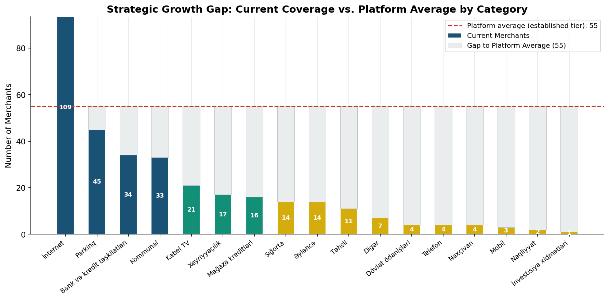
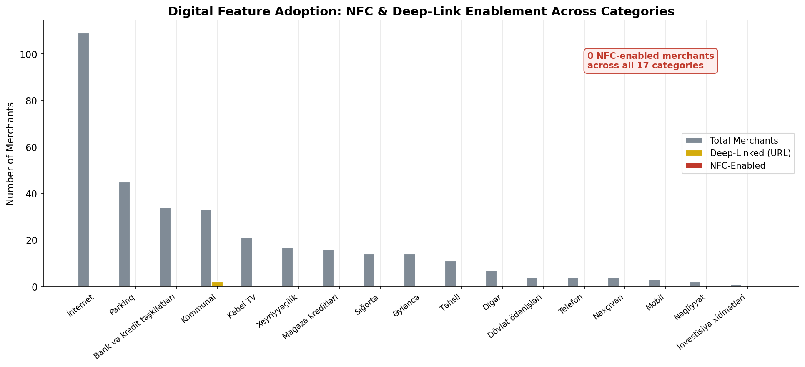
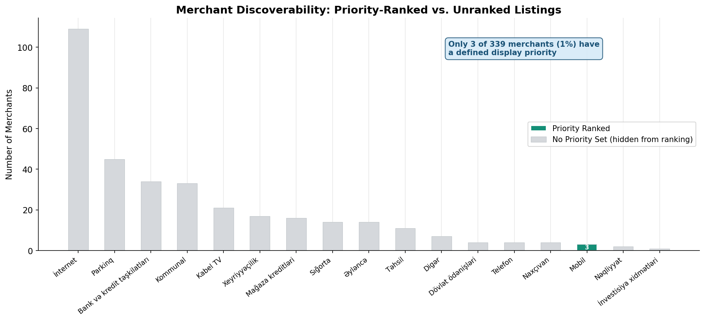

# Hesab.az Platform — Business Intelligence Report

- > **Audience:** Executive leadership, product owners, and business development managers.
- > **Data:** 339 merchants across 17 service categories listed on the hesab.az payment platform.

---

## Executive Summary

Hesab.az has built a broad payment platform spanning 17 service verticals and 339 merchants. The platform is operationally healthy — every single listed merchant is active — but the analysis reveals three structural challenges that limit growth potential: **severe category imbalance**, **untapped digital capabilities**, and **weak merchant discoverability infrastructure**. The findings below translate directly into prioritized actions for the business.

---

## Finding 1 — One Category Carries a Third of the Platform

The Internet category alone hosts **109 merchants — 32% of the entire platform**. The top 5 categories (Internet, Parking, Banking, Utilities, Cable TV) collectively account for **65% of all merchants**, leaving the remaining 12 categories to share the other 35%.

**What this means for the business:**
- The platform's perceived value is heavily tied to a single vertical. A regulatory change, a competitive entrant, or a market shift in internet services would disproportionately impact overall platform performance.
- Categories like Transportation (2 merchants), Investment Services (1 merchant), and Mobile (3 merchants) are dramatically under-represented relative to their real-world market size in Azerbaijan.

**Recommended action:** Initiate a merchant acquisition campaign specifically targeting Transportation, Government Services, Investment, and Mobile verticals to reduce dependency concentration and expand user relevance.

---

## Finding 2 — The Platform is Dominated by a Single Merchant Tier

Of 339 total listings, **322 (95%) are standalone direct merchants**. Only 17 listings (5%) are sub-service groups — meaning merchants with structured product breakdowns (e.g., a bank offering separate entries for loans, deposits, and transfers).

Sub-service groups currently exist only in: Banking (8), Utilities (3), Charity (3), Insurance (1), Government (1), and Other (1).

**What this means for the business:**
- Categories with sub-service structure signal higher product complexity and likely higher transaction frequency and value. Banking having 8 sub-groups is a strong indicator of engagement depth.
- The majority of merchants are presented as flat, undifferentiated entries — making it harder for users to find the specific service they need and reducing payment conversion rates.

**Recommended action:** Work with high-volume categories (Internet, Parking) to introduce structured sub-service breakdowns. This mirrors what is already working in Banking and can improve user experience and transaction completion rates.

---

## Finding 3 — Five Categories Dominate; Twelve Are Underserved

The top 5 categories collectively hold 220 of 339 merchant slots. The remaining 12 categories average just **9 merchants each** — far below the 57-merchant average of the top tier.

**What this means for the business:**
- Underserved categories represent untapped revenue. Each additional merchant in high-intent categories (Government payments, Transportation, Investment) directly expands the addressable user base.
- Users who cannot complete a payment on the platform due to missing merchants will seek alternatives — and may not return.

---

## Finding 4 — 14 of 17 Categories Have a Significant Coverage Gap

Using the average merchant count of the platform's established categories (Internet, Parking, Banking) as a benchmark, 14 out of 17 categories fall below this level — many significantly so.

The largest absolute gaps are in:
- **Emerging categories** (Transportation, Investment, Mobile) — nearly zero presence
- **Mid-tier categories** (Education, Entertainment, Insurance) — meaningful presence but still well below benchmark

**What this means for the business:**
- Closing even half the gap in mid-tier categories would increase total platform listings by approximately 30–40%, expanding the platform's market coverage and user retention potential.

**Recommended action:** Prioritize categories with high real-world transaction frequency but low platform representation: Education (tuition payments), Transportation (transit ticketing), and Government Services (fee and tax payments).

---

## Finding 5 — Zero Merchants Support Contactless (NFC) Payments

Across all 339 merchants and all 17 categories, **not a single merchant has NFC (contactless payment) enabled**. Additionally, only 2 merchants have any form of external deep-link integration.

**What this means for the business:**
- NFC payments are a fast-growing consumer preference, particularly in urban markets. The complete absence of NFC enablement means the platform is missing the contactless payment trend entirely.
- With smartphone penetration rising in Azerbaijan, the window to establish NFC leadership is now — before competitors activate it first.
- The near-zero deep-link adoption means the platform cannot drive targeted marketing campaigns or direct users to specific payment flows from external channels (SMS, push notifications, social media).

**Recommended action:** Launch an NFC enablement program, starting with the highest-volume categories (Internet, Parking, Banking). Simultaneously, build a deep-link framework to support performance marketing and re-engagement campaigns.

---

## Finding 6 — 99% of Merchants Have No Display Priority, Harming Discoverability

Of 339 merchants, **only 3 have a defined display priority**. The remaining 336 (99%) carry a default "no priority" flag, meaning they appear in an effectively random order.

**What this means for the business:**
- Merchants that users cannot easily find are merchants that do not generate revenue. Poor discoverability directly depresses transaction volume.
- There is no current mechanism to promote featured merchants, run sponsored placements, or surface seasonally relevant services (e.g., insurance during vehicle registration season, charity during Ramadan).
- This is also a missed commercial opportunity: priority placement is a standard monetization lever for marketplace platforms — currently entirely unused.

**Recommended action:** Implement a merchant ranking system based on transaction volume, user ratings, or commercial agreements. This simultaneously improves user experience and opens a new revenue stream through premium placements.

---

## Strategic Priorities — Summary

| Priority | Finding | Potential Impact |
|---|---|---|
| 1 | Expand merchant coverage in underserved categories | Revenue diversification, user retention |
| 2 | Activate NFC payments across high-volume categories | Capture contactless payment market |
| 3 | Implement merchant priority and ranking system | Discoverability + new monetization channel |
| 4 | Introduce sub-service structures in flat categories | Conversion rate improvement |
| 5 | Reduce top-5 category concentration risk | Platform resilience and stability |

---

*Analysis based on 339 active merchant records across 17 service categories.*
